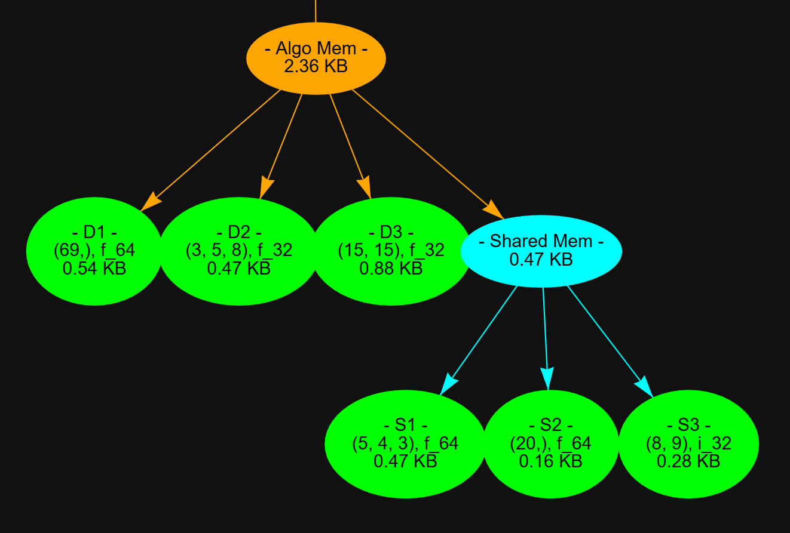
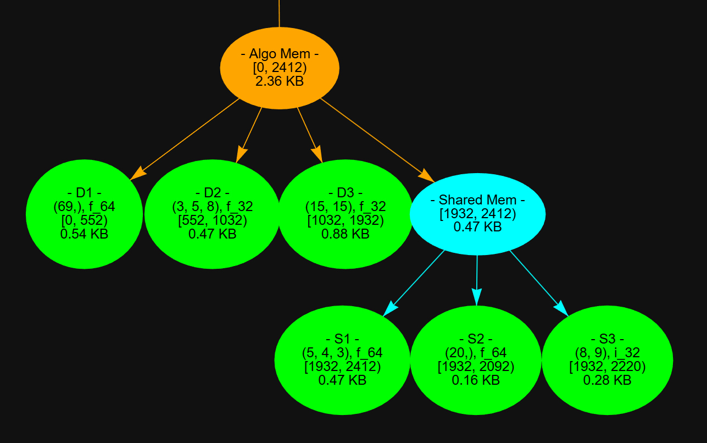
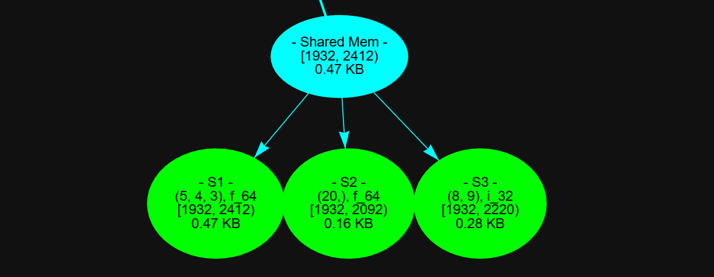
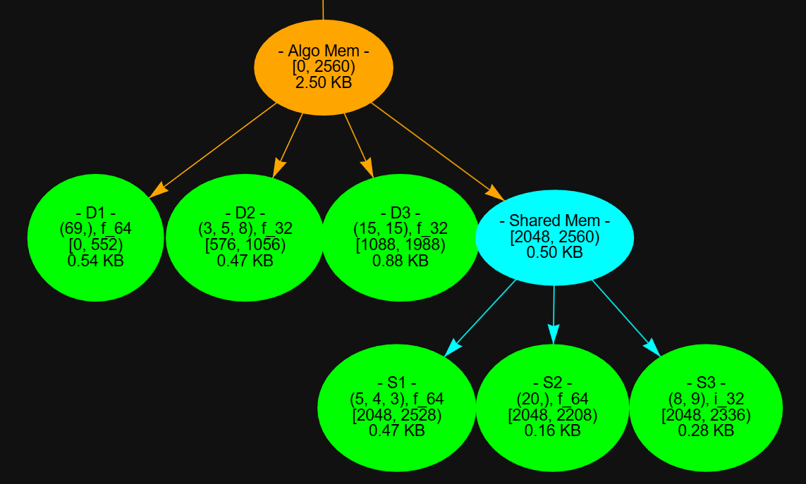
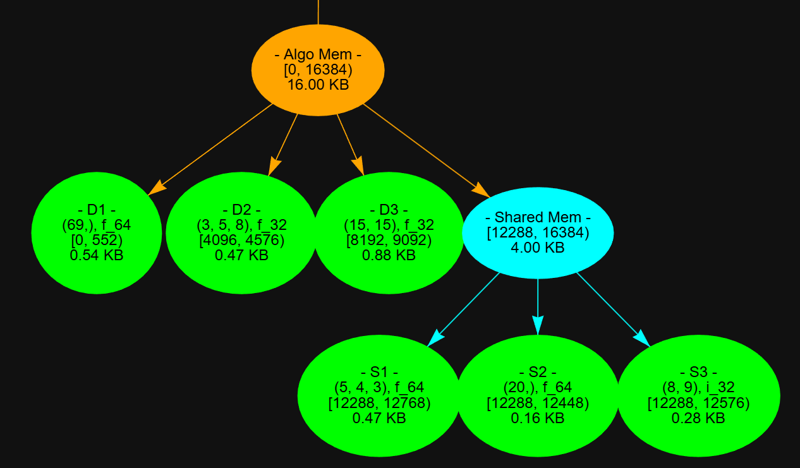
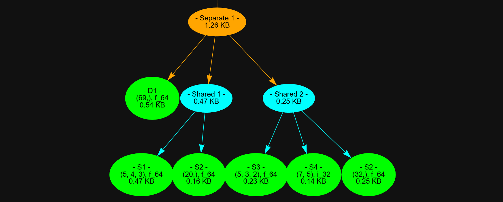
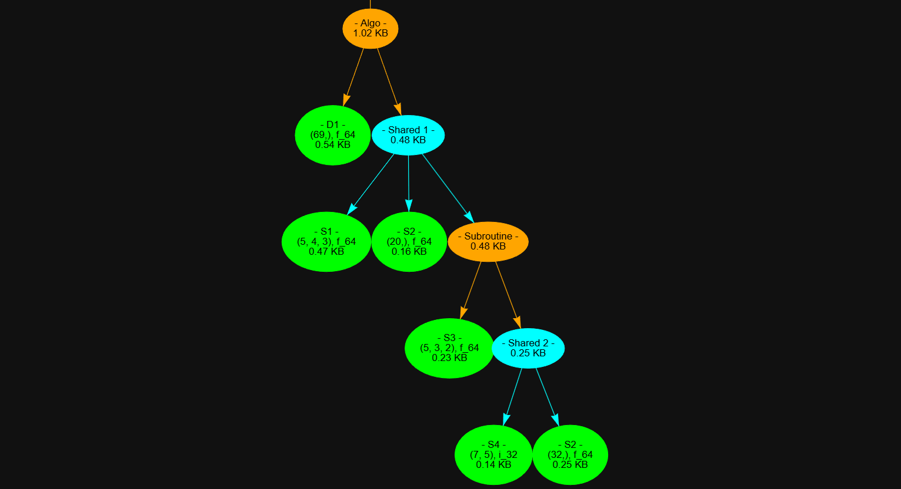

# Basic Use
We will begin our example by abbreviating the typical considerations in developing a numerical algorithm on CPU top to bottom:
1. System RAM. Where memory allocations originate. Typically dubbed a *heap* allocation though software notions like heap/stack are independent of the hardware specs.
2. CPU caches, usually L1-3. Utilized in prefetching memory blocks to speed up repeated memory accesses. Caching is largely responsible for the improvement in stack
3. The Core registry, where data is loaded by the (two) read ports, operated on by the other ports, and written out by the often singular write port. Modern ports can handle (roughly) one AVX512 instruction set per core cycle collectively as a single unit. [For more info on this](https://en.wikichip.org/wiki/intel/microarchitectures/skylake_(client)#Scheduler_Ports_.26_Execution_Units).
    - Just from the different amount of read and write ports we can see that instructions groups will have bias. It means that if we can coax the compiler into utilizing every port of the core on vectorization, we could in theory achieve the most operation dense and fast kernel.
    - This leads to some interesting micro benchmarks on kernels that fully or partially subscribe to the [triad](https://www.intel.com/content/www/us/en/developer/articles/technical/optimizing-memory-bandwidth-on-stream-triad.html) template. Performing much better per operation than simpler kernels. However this is beyond the scope of this demo.  

The target of performance optimization in this library is point 1 and 2. In compiled code, calling `malloc` in the default manner and releasing buffer allocations is slow; skipping the discussion on why that is, we realize a priority to reuse memory for dense numerical array operations. Following this reasoning we can group buffer memory into two parts:  
| Shareable Memory                                                                        | Distinct Memory                                                                             |
| --------------------------------------------------------------------------------------- | ------------------------------------------------------------------------------------------- |
| All temporary arrays, e.g. used as scratch<br>and that do not require simultaneous use. | All arrays that contain data needed over<br>the lifetime of execution, e.g. looping bodies. |

What we find is that any *shareable memory* arrays can overlap and use the same buffer, except for the section holding *distinct memory*. While distinct memory holds arrays that cannot be shared with each other or the buffer holding the shared memory. Infact we can call the shared memory node an array (member) of the distinct node. These dependencies have the workings of a tree, and we can in fact represent this with **Numpy Buffermap** like so:


```python
import np_buffermap as npb
import numpy as np

# --- `ar_spec` returns an ArrayNode which contains all the arguments necessary to construct an array. 
#arrays that save their data
dist1=npb.ar_spec((69,),name='D1') #distinct array 1
dist2=npb.ar_spec((3,5,8),np.float32,name='D2',) #distinct array 2
dist3=npb.ar_spec((15,15),np.float32,name='D3',) #distinct array 3

#scratch arrays.
s1=npb.ar_spec((5,4,3),name='S1')
s2=npb.ar_spec((20,),name='S2')
s3=npb.ar_spec((8,9),np.int32,name='S3',order='F')

# --- Now we utilize ContainerNode which come in two flavors: 
#SharedNode sb_node - shared buffer node, 
#DistinctNode db_node - distinct buffer node.
mem_map=npb.db_node(dist1,dist2,dist3,name='Algo Mem')
shared_mem=npb.sb_node(s1,s2,s3,name='Shared Mem')
mem_map.add(shared_mem)

print(mem_map,'\n')
#Calculates dimensions and ranges of buffer offsets, and places that info into the tree.
#Separate because you might want to see how the byte offsets are calculated first, before allocating lots of memory.
npb.build_bmap(mem_map,align=npb.BufferAlign.BYTE) #byte is equivalent to no extra padding of array alignments.

#all the arrays are now initialized with shared or distinct buffer offsets.
ars=mem_map.build_flatmap(align=npb.BufferAlign.BYTE)
[print(i.shape,i.dtype,type(i)) for i in ars]

ot=npb.bmap_pyvis(mem_map,with_offsets=True,height='1000px')
ot.prep_notebook()
ot.show('D:/Projects/Repositories/numpy_buffermap/renders/algo_mem_1.html',notebook=True)

```

    |Node Algo Mem rule=D children=4|
    ╠══ |Array D1 (69) float64|
    ╠══ |Array D2 (3, 5, 8) float32|
    ╠══ |Array D3 (15, 15) float32|
    ╚══ |Node Shared Mem rule=S children=3|
        ╠══ |Array S1 (5, 4, 3) float64|
        ╠══ |Array S2 (20) float64|
        ╚══ |Array S3 (8, 9) int32| 
    
    (69,) float64 <class 'numpy.ndarray'>
    (3, 5, 8) float32 <class 'numpy.ndarray'>
    (15, 15) float32 <class 'numpy.ndarray'>
    (5, 4, 3) float64 <class 'numpy.ndarray'>
    (20,) float64 <class 'numpy.ndarray'>
    (8, 9) int32 <class 'numpy.ndarray'>
    [<pydot.core.Dot object at 0x0000026798FD36E0>]
    D:/Projects/Repositories/numpy_buffermap/renders/algo_mem_1.html
    

| No Byte Offset                 | With Byte Offset               |
| ------------------------------ | ------------------------------ |
|  |  |

Byte offsets represent the section of bytes that the array will occupy in the buffer. `with_offsets=False` as with large/many arrays you may not want to see them.

Additionally, it's possible to plot just a sub-node and still see it's buffer offsets, calling `npb.build_bmap` on an ancestor will place offsets along the entire tree.


```python
ot=npb.bmap_pyvis(shared_mem,with_offsets=True,height='1000px')
#ot.prep_notebook()
ot.show('D:/Projects/Repositories/numpy_buffermap/renders/algo_mem_sub1.html',notebook=False)
```

    [<pydot.core.Dot object at 0x000002679900AE40>]
    D:/Projects/Repositories/numpy_buffermap/renders/algo_mem_sub1.html
    



### Buffer Alignment

Especially on AVX512 CPUs it may be possible to gain a ~10% performance improvement for memory bound tasks just by [aligning pointers](https://stackoverflow.com/questions/74785348/is-there-any-performance-difference-between-avx-512-mm512-load-epi64-and-mm) to the largest instruction width on your system, or to the system's page size. Standalone we provide a simple array allocator `npb.aligned_buffer`, that will also work in numba decorated functions. To align all arrays in our buffer map, it's simple:


```python
npb.build_bmap(mem_map,align=npb.BufferAlign.AVX512)
ot=npb.bmap_pyvis(mem_map,with_offsets=True,)
ot.show('D:/Projects/Repositories/numpy_buffermap/renders/algo_mem_avx5121.html',notebook=False)
npb.build_bmap(mem_map,align=npb.BufferAlign.PAGE)
ot=npb.bmap_pyvis(mem_map,with_offsets=True,)
ot.show('D:/Projects/Repositories/numpy_buffermap/renders/algo_mem_page1.html',notebook=False)
#Notes: Larger alignments are already aligned with smaller ones. Multiple distinct arrays that all fit within a single could make sense for multiple large arrays or multiple shared arrays th, but with multiple 
```

    [<pydot.core.Dot object at 0x000002679907D1F0>]
    D:/Projects/Repositories/numpy_buffermap/renders/algo_mem_avx5121.html
    [<pydot.core.Dot object at 0x0000026798DE6270>]
    D:/Projects/Repositories/numpy_buffermap/renders/algo_mem_page1.html
    

See now that all arrays align with a multiple of their byte size, and there is extra space between distinct offspring:

| Avx512                              | Page                              |
| ----------------------------------- | --------------------------------- |
|  |  |


# Dependency Examples

### Container Hierarchy

A feature of the buffer map is that: The least-node representation (that doesn't alter tree traversal order) will never have offspring with the same container node type; meaning a Shared Node will always be the offspring of a Distinct Node, and vice versa. Because
1. The child shared node will also share memory with all nodes and arrays in the parent shared node.
2. A child distinct node will hold arrays/nodes that do not overlap with each other, and any arrays in the parent distinct node.

This is why there is a `nomerge` parameter in `db_node`, `sb_node` constructors. `build_bmap` will automatically merge these like-type nodes for you. 

Relatedly, there are two ways I think about array overlap depending on what is most convenient:
1. We have multiple groups of arrays that can overlap, but each group cannot overlap with any other.
2. We have arrays that must not overlap with each other, but as a group it's ok for them to overlap.

## 1. Multiple Shared Groups
The most obvious example would be allocating work memory in a multi-threaded environment, either task clones or different procedures:


```python
import np_buffermap as npb
import numpy as np

d1=npb.ar_spec((69,),name='D1') #distinct array 1
mem_map=npb.db_node(d1,name='Separate 1')
#share 1
s1=npb.ar_spec((5,4,3),name='S1')
s2=npb.ar_spec((20,),name='S2')
share1=npb.sb_node(s1,s2,name='Shared 1')

s3=npb.ar_spec((5,3,2),name='S3')
s4=npb.ar_spec((7,5),np.int32,name='S4',order='F')
s5=npb.ar_spec((32,),name='S2')
share2=npb.sb_node(s3,s4,s5,name='Shared 2')

mem_map.add(share1,share2)

npb.build_bmap(mem_map,align=npb.BufferAlign.BYTE) #to see total bytes comparing example 2 below
print(mem_map.nbytes) #Cumulative total number of bytes by default it is avx512 aligned.

ot=npb.bmap_pyvis(mem_map,with_offsets=False,)
ot.show('D:/Projects/Repositories/numpy_buffermap/renders/algo_mem_shared.html',notebook=False)

```

    1288
    [<pydot.core.Dot object at 0x000002679900D370>]
    D:/Projects/Repositories/numpy_buffermap/renders/algo_mem_shared.html
    


## 2. Multiple Distinct Groups

This situation is very common in serial execution. Consider an algorithm that has the typical shared and distinct groups. Then we have a subroutine that too has a shared and distinct group, but after completion all of it's memory can be reused:


```python
import np_buffermap as npb
import numpy as np

#Primary Algo
d1=npb.ar_spec((69,),name='D1')
algo=npb.db_node(d1,name='Algo')
#share 1
s1=npb.ar_spec((5,4,3),name='S1')
s2=npb.ar_spec((20,),name='S2')
share1=npb.sb_node(s1,s2,name='Shared 1')

#Subroutine
s3=npb.ar_spec((5,3,2),name='S3')
sub=npb.db_node(s3,name='Subroutine')

s4=npb.ar_spec((7,5),np.int32,name='S4',order='F')
s5=npb.ar_spec((32,),name='S2')
share2=npb.sb_node(s4,s5,name='Shared 2')
sub.add(share2)

#Now because we know subroutine mem can be utilized by shared algo mem
#we just need to place it in share1
share1.add(sub)
#And share1 into Algo
algo.add(share1)

npb.build_bmap(algo,align=npb.BufferAlign.BYTE) 
print(algo.nbytes)

ot=npb.bmap_pyvis(algo,with_offsets=False,)
ot.show('D:/Projects/Repositories/numpy_buffermap/renders/algo_mem_distinct.html',notebook=False)
```

    1048
    [<pydot.core.Dot object at 0x0000026799011CA0>]
    D:/Projects/Repositories/numpy_buffermap/renders/algo_mem_distinct.html
    



So far I've been able to represent all memory layouts for any arbitrarily complex routine I've built. You may also find that you can represent the same dependencies using multiple different container arrangements. My theory is that every memory layout is representable with the correct construct, however I'd love to see a counter example.
